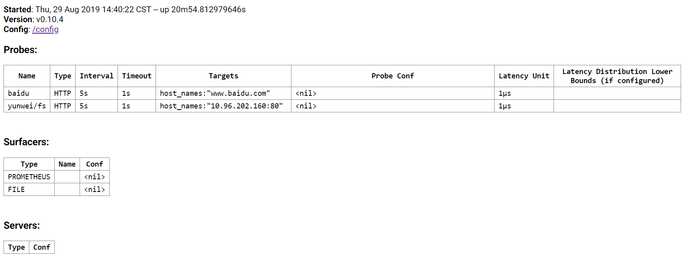

# Service-Prober

Sync kubernetes service to cloudprober service( run inside the same container )

## Usage

```
# Service
apiVersion: v1
kind: Service
metadata:
  name: fs
  namespace: yunwei
  annotations:
    prober.haodai.net/enable: "true"
```

> remove annotation will remove the probe entry.

## Configure path

service annotations:

| annotation | example value |
|---|--|
|prober.haodai.net/enable: | "true" |
|prober.haodai.net/path: | "/healthz" |


## Cloudprober status page

